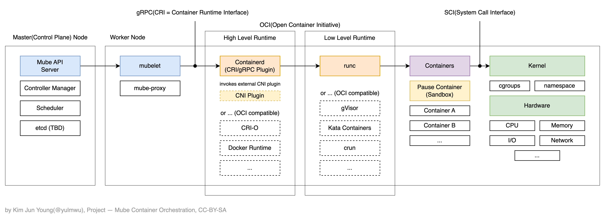

> [!NOTE]
> 
> This architecture represents a planned design and may be subject to change at any time. It will be updated accordingly whenever changes occur. For now, it closely follows the Kubernetes architectural model.

